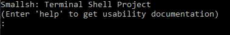
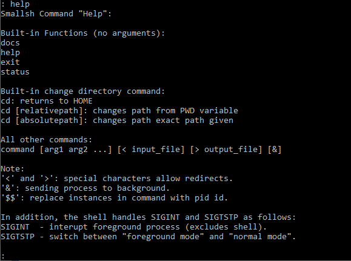
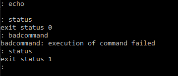
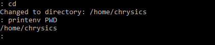
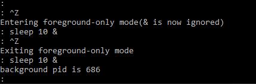

# Portfolio Project: `Smallsh` shell program
Author: Christopher Eckerson 
Date: 2/8/2021

### Summary: 
This program creates a small terminal shell that can take bash commands. 

Three commands are built-in: `exit`, `status`, `help`, and `cd`.
All other commands are performed in separate processes using fork and and execvp function 
(searches for commands in the 'PATH' environment variable).  

The shells special characters for handling redirects and sending to background are `<` (input redirect), `<` (output redirect), and `&` sends command to background. 
In addition, when the shell handles an input with `$$`, it will expand that to the parents pid number.

#### Command format is as follows:
>: `command` [arg1 arg2 ...] [`<` input_file] [`>` output_file] [`&`]

For example,
>`: ls -l -a > output_file.txt &`

<i>(This calls the bash command `ls` with arguments, redirects output to `output_file.txt` as background file)</i>

### Built-in Functions:
`help` command: 
View usability instructions 

`exit` command: 
Takes no arguments, closes all background processes before closing the shell itself. 

`status` command: 
Takes no arguments, returns the last foreground command exit status.  

`cd` command: 
* If given no arguments, returns user to the directory specified by the 'HOME' environment variable.  
* Otherwise if given one argument for the filepath to the desired directory, will take user to that directory. Allows absolute and relative paths. Updates the 'PDW' environment variable. 

In addition, the shell handles SIGINT and SIGTSTP as follows: 
SIGINT - sends a SIGINT to only foreground process (exclude shell) 
SIGTSTP - sends a SIGTSTP that switches between "foreground mode" and "normal mode". In foreground mode, and commands that are requested to be sent to the background will not do so.

### To compile (For Linux):
gcc -std=gnu99 -g -o smallsh main.c

(Or to simply auto-compile, just enter "compile.sh")

### To run:
./smallsh
